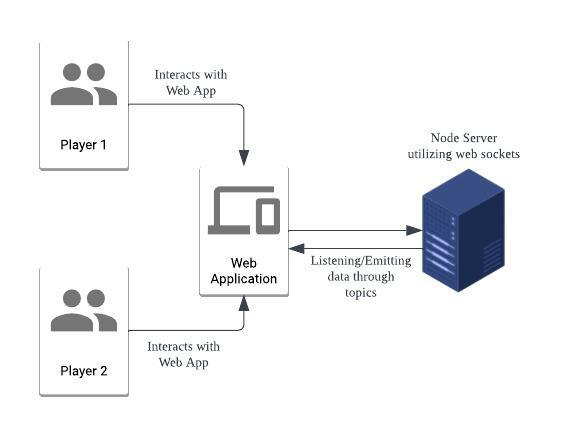

# Tic Tac Toe Game 

## Introduction
This prototype creates a multiplayer tic tac toe game using socket programming.  

**Frontend**: Next.js 
**Socket Server**: Node.js with Socket.io

# Running the Frontend Server
1. Ensure you have Node.js installed in your system
2. Run **npm install** 
3. Run **npm start** to start the server
4. Open [http://localhost:3000](http://localhost:3000) with your browser to see the result.

# Web App Navigation
1. Navigate to [http://localhost:3000] where you will be at the Lobby Screen
2. Key a desired room number 2 join, share this room number with your friends for them to join your room
3. Click the button to join a Session and wait for your friend
4. From there you can start playing the game

# Walkthrough Video
Youtube Link: [https://youtu.be/6-m30IVLt78]

# API Functions
Currently, I did not program any RESTful APIs as I am using Web Sockets to transfer data between the Frontend and the Backend. While using Web sockets at the Transport Layer, Socket.io allowed me to implement a pub/sub model where clients can listen and emit messages.

# Design Decisions and Accessibility Considerations
1. **Colour Blindness**: Based on a quick research, best colours to use are black and white. I used black fonts with white background in order to allow users with colour blindness to read the fonts easily.
However, in order to differentiate the text from the Gameplay, I coloured the Players "0" and "X" with Blue and Red which is another pair of colours that allows users to easily distinguish the players.  
Source: [https://www.datylon.com/blog/data-visualization-for-colorblind-readers]
2. **Simplicity**: I kept my design simple in order to allow PWD users to absorb information from the site easily. Built-in Text-To-Speech from Browsers allows user with blur vision to listen to the Text in the Website. 
3. **Compactness** - I do have a classmate that has too navigate the webpage using 180% zoom due to his visual disability. He has a difficult time navigating my institute's portal as which has content all around the webpage. Hence, I kept my UI compact to prevent navigation around the webpage when users zoom into the page to view the UI Elements.

# Architecture Diagram 

# Future Works
1. Implementing a Speech-To-Text which allows users to say which squares they would like to implement
2. Different Colour Setting for Visually Impaired Users
